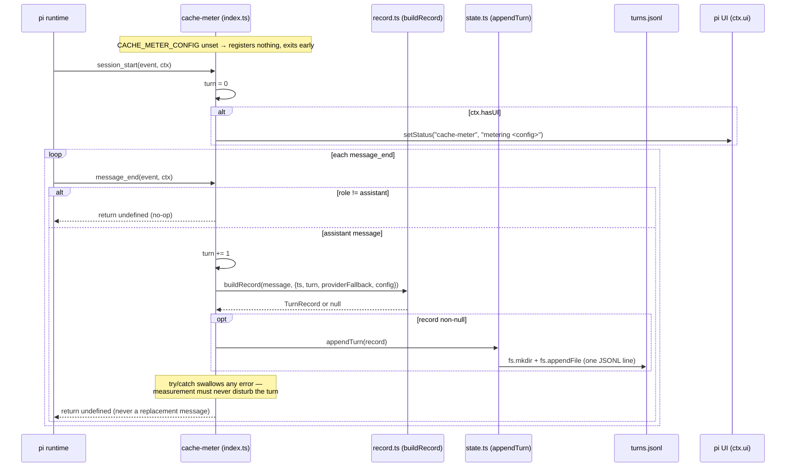
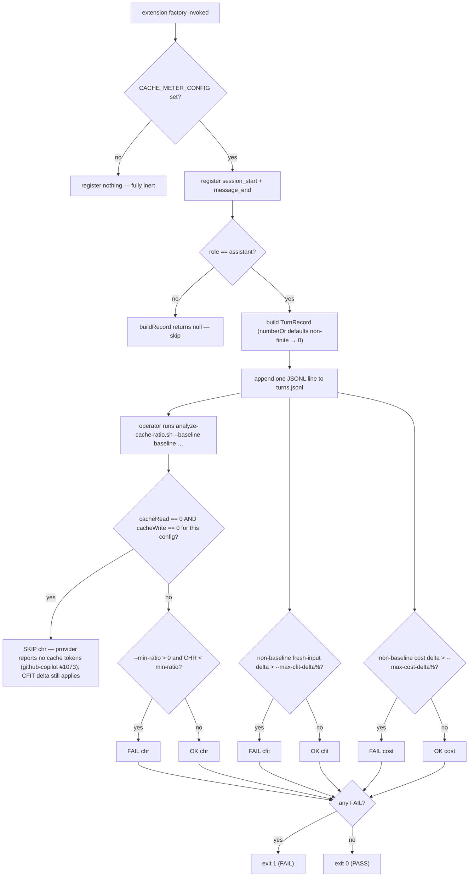
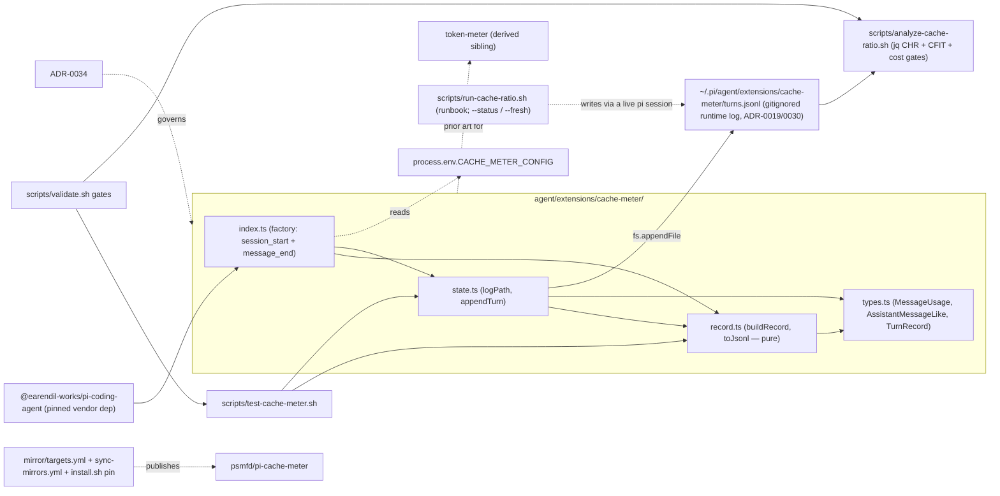

# cache-meter

A **read-only** measurement recorder for the suite-wide prefix-churn / cache-ratio
gate (#338, [ADR-0034](https://github.com/psmfd/pi-config/blob/main/adrs/0034-cache-ratio-measurement.md)).
Provider prompt caching prices cached input tokens ~10× below fresh; any feature
that rewrites the cached message **prefix** on each call invalidates the cache
forward and can cost more than it removes. This extension captures the per-turn
token usage needed to verify our extensions don't do that.

## Install

```sh
pi install git:github.com/psmfd/pi-cache-meter
```

Try it first without installing: `pi -e git:github.com/psmfd/pi-cache-meter`.

## What it does

When `CACHE_METER_CONFIG` is set, the `message_end` handler appends one JSONL
record per **assistant** turn to `~/.pi/agent/extensions/cache-meter/turns.jsonl`,
tagged with that config slot:

```jsonc
{ "ts":"…","turn":3,"model":"claude-opus-4-8","provider":"anthropic",
  "input":1200,"cacheRead":8000,"cacheWrite":0,"output":300,"costTotal":0.014,"config":"baseline" }
```

`input` is **fresh** (uncached) input only, so the cache-hit ratio is
`cacheRead / (cacheRead + input)`. `model` and `provider` are read **atomically
from the message itself** — so a mid-session model switch (e.g. an auto-router
run) attributes each turn's usage to the provider that actually produced it, not
the session's current model.

**Inert by default.** With `CACHE_METER_CONFIG` unset the extension registers
nothing and records nothing — zero overhead in normal sessions.

**Session indicator + turn reset.** When metering is active and a UI is attached
(`ctx.hasUI`), `session_start` shows a footer status indicator
(`📊 metering <config>`) for the whole session and resets the per-session turn
counter to 1. In a headless run there is no indicator; recording is unaffected.

**Observational only.** The `message_end` handler returns `undefined` and never a
replacement `{ message }`. A measurement tool that rewrote the message would
itself churn the prefix it is meant to measure — that invariant is the whole
point, so the recorder must not break it.

**Failures are swallowed by design.** The whole record-build-and-append path is
wrapped in a `try/catch` that discards any error ("measurement must never disturb
a turn"). A JSONL write failure (disk full, permissions) therefore drops that
turn's record **silently** — cross-check the recorded turn count with
`./scripts/run-cache-ratio.sh --status` against the turns you actually ran if a
measurement looks short.

## How it works

**Event flow** — the two handlers and the read-only append path:



**Decisioning** — the recording gate, then the offline analysis gates:



**Dependencies and on-disk footprint** — the extension owns its four files (no
`shared/` dependency, no cross-extension import); analysis lives in `scripts/`:



## Measuring (operator workflow)

The live measurement needs real provider sessions (cache fields come from the
provider), so it is **not** CI-automated. Config slots are
`baseline | auto-router | context-manager | indexing | all`. Per slot:

```bash
CACHE_METER_CONFIG=baseline ./scripts/run-cache-ratio.sh   # prints the runbook + prompt battery for the slot
# …start a real pi session with CACHE_METER_CONFIG=baseline, run the battery, exit…
CACHE_METER_CONFIG=indexing ./scripts/run-cache-ratio.sh   # repeat for each slot

./scripts/run-cache-ratio.sh --status   # recorded turns per config so far
./scripts/run-cache-ratio.sh --fresh    # truncate the log to start over
```

Then analyze:

```bash
./scripts/analyze-cache-ratio.sh \
  --log ~/.pi/agent/extensions/cache-meter/turns.jsonl \
  --baseline baseline --min-ratio 0.5 --max-cfit-delta 5 --max-cost-delta 10
```

`analyze-cache-ratio.sh` reports per-config cache-hit ratio (CHR) and
fresh-input/cost deltas vs baseline, with pass/fail thresholds. A provider that
reports neither `cacheRead` nor `cacheWrite` yields **SKIP** on the CHR gate (not
a false PASS — see the Provider note); the fresh-input (CFIT) delta still applies
as a proxy. Exit codes: **0** = PASS (warnings allowed), **1** = FAIL (a
threshold was violated), **2** = environment/usage failure.

## Provider note

Authoritative CHR requires a provider that reports cache tokens — the
**Anthropic** path (`anthropic-messages`) populates `cacheRead`/`cacheWrite`;
OpenAI-style paths populate `cacheRead` only (`cacheWrite` always 0); the
**github-copilot** SDK currently reports both as 0 (SDK issue #1073), which is
why that provider yields SKIP rather than a false PASS on the CHR gate. See
ADR-0034.

## Files

| File | Role |
| --- | --- |
| `index.ts` | Factory: gated `message_end` recorder (read-only) + `session_start` turn reset and status indicator. |
| `record.ts` | Pure turn-record construction from `message.usage` (no I/O, no clock); provider read from the message with a ctx fallback. |
| `state.ts` | Append-only JSONL writer under the cache-meter namespace. |
| `types.ts` | Usage/record structural types. |

Analysis + runbook live in `scripts/analyze-cache-ratio.sh` and
`scripts/run-cache-ratio.sh`.

## Tests

`scripts/test-cache-meter.sh` (extension unit tests) and
`scripts/analyze-cache-ratio.sh --self-test` (analysis-logic fixtures) both run
under `validate.sh`. The live measurement is not gated in CI.
